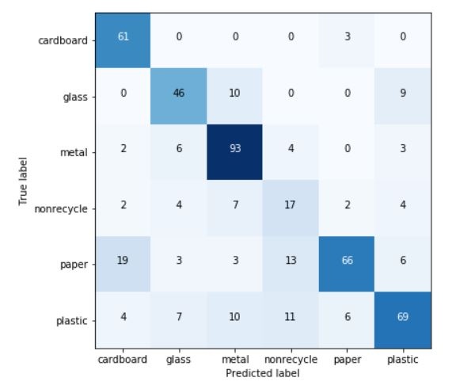

# Different CNN Models to classify trash images for Recycling

FinalAlex.ipynb - CNN using AlexNet Model  
FinalVGGNet.ipynb - CNN using VGGNet Model  
FinalMobileNet.ipynb - CNN using MobileNet Model  
FinalResNet.ipynb - CNN using ResNet Model  

## Results

### Alex CNN

### VGG CNN

Data is inside Code/Garythung-net folder
Models saved in Code/Garythung-net/model and Code/Garythung-net/model1
The code works in Google Colab with the entire garythung-net folder in your Google drive.
